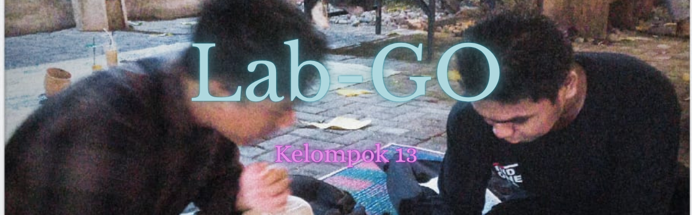

# Infiniti-Project

## Lab-Go (Laboratory On The Go)

LabGo (Laboratory On The Go) adalah sebuah platrfrom penanyangan ketersedian laboratorium dalam mempermudahh mahasiswa dan dosen saat ingin melakukan beberapa praktikum, aplikasi ini nantinya akan menayangkan laboratorium mana yang sekiranya masih kosong untuk digunakan oleh mahasiswa dan dosen, dengan cara saat mahasiswa atau dosen ingin menggunakan laboratorium praktek, dosen dimohon untuk  memasukan kelas mana yang sedang menggunakan laboratoriumnya, jam mulai sampai jam selesai, dan sejenis kode atau token login untuk menggunakan laboratorium tersebut. Yang nantinya akan terinput di sistem dan menunjukan data di layar bahwa lab tersebut telah diisi, dan pengguna juga bisa mencari ruang laboratorium mana yang masih kosong(belum terisi).

** Tujuan Projek **

Substitute: Mengantikan penggunaan telepon untuk mempermudah    penerimaan informasi jadwal laboratorium
Combine: Menggabungkan fitur online, dan krs satu aplikasi terpadu.
Adapt: Menyesuaikan konsep sistem krs mahasiswa 
Modify: Memodifikasi layanan menjadi lebih sederhana, interaktif, dan ramah pengguna.
Put to another use: Memanfaatkan data jadwal laboratorium
Eliminate: Menghilangkan hambatan dalam menghubungi Laboran
Reverse: Mengubah kebiasaan dalam menghubingi laboran melaui telepon → menjadi .melihat jadwal kosong

** Daftar Tugas **
| Tugas | Deskripsi |
| --- | --- |
|Charter|[x] Done |
|Proposal|`On Going` |
|None|None|
|None|None|

### Nama Anggota
* Dylan Daffa reifiansyah   (Hustler 🎤)
* Arlan Tengga              (Hacker 💀)
* Alan Nugraha              (Hacker 💀)

Tugas Infinite-Uny 2025